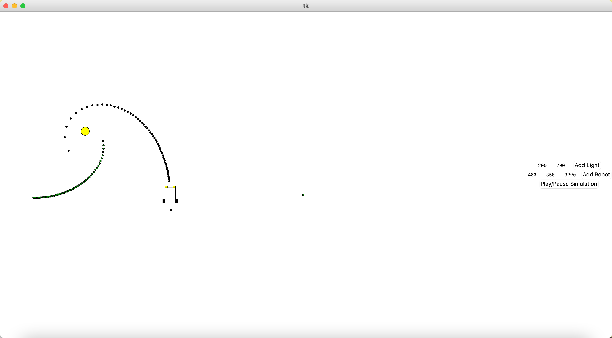

# Braitenberg-Vehicles

Simulated the Braitenberg Vehicles with configurable directions on GUI using differential driving techniques.

## Installation

Install numpy through numpy

```bash
pip install numpy
```

## Compilation & Run


```python
python Main.py
```

## Demonstration

Taking the lights position, vehicle position, and K matrix as input, where K matrix affects how sensitive is the vehicle to the received light intensity from the sensor. \
The Instantaneous Center of Curvature is plotted in green, and Vehicle path is plotted in black.\


## Contributing
Pull requests are welcome. For major changes, please open an issue first to discuss what you would like to change.

Please make sure to update tests as appropriate.

## License
[MIT](https://choosealicense.com/licenses/mit/)

## Reference
CSCE 452 from Texas A&M University

## Contributor
Avinash Chaurasia\
Michaela Matocha\
Kyle Lamb\
Osric Nagle
